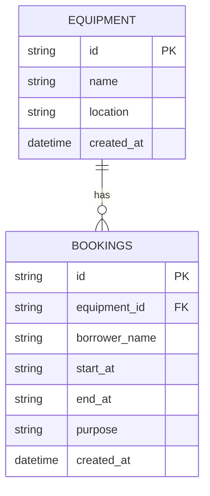

# Campus Equipment Booking API - Contract Documentation

Base URL: `http://localhost:8787/api` (or configured port)

## Data Models

### Equipment
| Field | Type | Description |
|---|---|---|
| `id` | String | Unique identifier (e.g., `eq-1`) |
| `name` | String | Name of the equipment (e.g., `Projector A`) |
| `location` | String | Storage or deployment location (e.g., `Building 1`) |

### Booking
| Field | Type | Description |
|---|---|---|
| `id` | String | Unique identifier for booking |
| `equipmentId` | String | ID of equipment being booked |
| `borrowerName` | String | Name of borrower |
| `startAt` | String (ISO 8601) | Booking start time in UTC/ISO format |
| `endAt` | String (ISO 8601) | Booking end time in UTC/ISO format |
| `purpose` | String | Reason for booking |

---

## Database ERD & Schema (SQLite)



---

## Endpoints

### 1. List Equipment
- **HTTP Method:** `GET`
- **Path:** `/api/equipment`
- **Response `200 OK`:**
  ```json
  [
    {
      "id": "eq-1",
      "name": "Projector A",
      "location": "Building 1"
    },
    {
      "id": "eq-2",
      "name": "4K Cinema Camera",
      "location": "Media Lab 202"
    }
  ]
  ```

---

### 2. List Bookings
- **HTTP Method:** `GET`
- **Path:** `/api/bookings`
- **Response `200 OK`:**
  ```json
  [
    {
      "id": "bk-101",
      "equipmentId": "eq-1",
      "borrowerName": "Somchai Jaidee",
      "startAt": "2026-10-20T09:00:00.000Z",
      "endAt": "2026-10-20T11:00:00.000Z",
      "purpose": "Class presentation"
    }
  ]
  ```

---

### 3. Get Single Booking
- **HTTP Method:** `GET`
- **Path:** `/api/bookings/:id`
- **Response `200 OK`:**
  ```json
  {
    "id": "bk-101",
    "equipmentId": "eq-1",
    "borrowerName": "Somchai Jaidee",
    "startAt": "2026-10-20T09:00:00.000Z",
    "endAt": "2026-10-20T11:00:00.000Z",
    "purpose": "Class presentation"
  }
  ```
- **Response `404 Not Found`:**
  ```json
  {
    "error": "Booking not found"
  }
  ```

---

### 4. Create Booking
- **HTTP Method:** `POST`
- **Path:** `/api/bookings`
- **Request Body:**
  ```json
  {
    "equipmentId": "eq-1",
    "borrowerName": "Somchai Jaidee",
    "startAt": "2026-10-20T09:00:00.000Z",
    "endAt": "2026-10-20T11:00:00.000Z",
    "purpose": "Class presentation"
  }
  ```
- **Response `201 Created`:**
  ```json
  {
    "id": "bk-101",
    "equipmentId": "eq-1",
    "borrowerName": "Somchai Jaidee",
    "startAt": "2026-10-20T09:00:00.000Z",
    "endAt": "2026-10-20T11:00:00.000Z",
    "purpose": "Class presentation"
  }
  ```
- **Error Responses:**
  - `400 Bad Request` (Missing fields or startAt >= endAt):
    ```json
    { "error": "startAt must be before endAt" }
    ```
  - `404 Not Found` (equipmentId does not exist):
    ```json
    { "error": "Equipment eq-999 does not exist" }
    ```
  - `409 Conflict` (Schedule overlap for the same equipment):
    ```json
    { "error": "Equipment is already booked for the requested time slot" }
    ```

---

### 5. Update Booking
- **HTTP Method:** `PATCH`
- **Path:** `/api/bookings/:id`
- **Request Body (partial update supported):**
  ```json
  {
    "startAt": "2026-10-20T10:00:00.000Z",
    "endAt": "2026-10-20T12:00:00.000Z"
  }
  ```
- **Response `200 OK`:** Updated booking object
- **Error Responses:**
  - `400 Bad Request`: Invalid date format or startAt >= endAt
  - `404 Not Found`: Booking or updated equipmentId not found
  - `409 Conflict`: Updated schedule conflicts with another booking for the target equipment

---

### 6. Delete Booking
- **HTTP Method:** `DELETE`
- **Path:** `/api/bookings/:id`
- **Response `204 No Content`** (Empty body)
- **Response `404 Not Found`:**
  ```json
  { "error": "Booking not found" }
  ```
