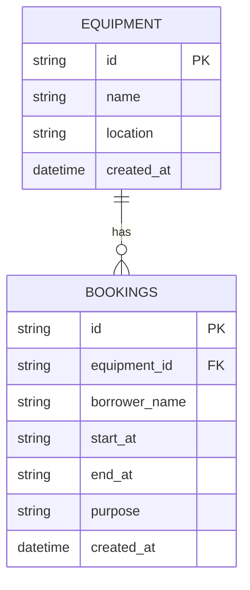

# Campus Equipment Booking API

**Stack:** Cloudflare Workers + Hono + Cloudflare D1 (SQLite)  
**Base API URL (Deployed):** `https://campus-equipment-booking-api.taskflow-taskmanager.workers.dev/api`  
**Base API URL (Local):** `http://127.0.0.1:8787/api`

---

## 🚀 Quick Start & Local Run Instructions

### 1. Install Dependencies
```bash
npm install
```

### 2. Run Local Development Server with D1 Database Emulator
```bash
npm run dev
```
The API server will start on `http://127.0.0.1:8787`. D1 tables and initial equipment data (`eq-1`, `eq-2`, `eq-3`) will be automatically created on startup.

### 3. Deploy to Cloudflare Workers
```bash
npm run deploy
```

---

## 📊 Database Schema & ERD

### Entity Relationship Diagram


### Seed Data (`equipment`)
- `eq-1`: Projector A (Building 1)
- `eq-2`: 4K Cinema Camera (Media Lab 202)
- `eq-3`: Meeting Room B (Library 3rd Floor)

---

## 📖 API Contract

| Method | Endpoint | Success Status | Description |
|---|---|---:|---|
| `GET` | `/api/equipment` | `200 OK` | List all available equipment records |
| `GET` | `/api/bookings` | `200 OK` | List all current equipment bookings |
| `GET` | `/api/bookings/:id` | `200 OK` | Get details for a single booking (or `404`) |
| `POST` | `/api/bookings` | `201 Created` | Create new equipment booking (Validates overlap `409`, dates `400`, equipment existence `404`) |
| `PATCH` | `/api/bookings/:id` | `200 OK` | Partial update of existing booking |
| `DELETE` | `/api/bookings/:id` | `204 No Content` | Cancel/delete an equipment booking |

### Error Format
All errors return a JSON object with status codes (`400`, `404`, `409`):
```json
{ "error": "Clear description of error" }
```

---

## 🧪 Test Cases & Empirical Evidence

Base API URL used for testing: `http://127.0.0.1:8787/api`

### Case 1: List Equipment (`GET /api/equipment`)
- **Status:** `200 OK`
- **Response:**
  ```json
  [
    { "id": "eq-1", "name": "Projector A", "location": "Building 1" },
    { "id": "eq-2", "name": "4K Cinema Camera", "location": "Media Lab 202" },
    { "id": "eq-3", "name": "Meeting Room B", "location": "Library 3rd Floor" }
  ]
  ```

### Case 2: Create Booking (`POST /api/bookings`)
- **Status:** `201 Created`
- **Request:**
  ```json
  {
    "equipmentId": "eq-1",
    "borrowerName": "Somchai Jaidee",
    "startAt": "2026-10-20T09:00:00.000Z",
    "endAt": "2026-10-20T11:00:00.000Z",
    "purpose": "Class presentation"
  }
  ```
- **Response:**
  ```json
  {
    "id": "bk-6af548c9",
    "equipmentId": "eq-1",
    "borrowerName": "Somchai Jaidee",
    "startAt": "2026-10-20T09:00:00.000Z",
    "endAt": "2026-10-20T11:00:00.000Z",
    "purpose": "Class presentation"
  }
  ```

### Case 3: Overlapping Booking Conflict (`POST /api/bookings`)
- **Status:** `409 Conflict`
- **Request:** Attempting to book `eq-1` from 10:00 to 12:00 (overlaps with 09:00–11:00)
- **Response:**
  ```json
  { "error": "Equipment is already booked for the requested time slot" }
  ```

### Case 4: Invalid Date Order Validation (`POST /api/bookings`)
- **Status:** `400 Bad Request`
- **Request:** Sending `startAt`: 15:00 and `endAt`: 13:00 (`startAt >= endAt`)
- **Response:**
  ```json
  { "error": "startAt must be strictly before endAt" }
  ```

### Case 5: Non-Existent Booking Query (`GET /api/bookings/bk-nonexistent`)
- **Status:** `404 Not Found`
- **Response:**
  ```json
  { "error": "Booking not found" }
  ```

### Case 6: Update Booking (`PATCH /api/bookings/:id`)
- **Status:** `200 OK`
- **Request:** Update borrower name and purpose for `bk-6af548c9`
- **Response:**
  ```json
  {
    "id": "bk-6af548c9",
    "equipmentId": "eq-1",
    "borrowerName": "Somchai Jaidee (Updated)",
    "startAt": "2026-10-20T09:00:00.000Z",
    "endAt": "2026-10-20T11:00:00.000Z",
    "purpose": "Final exam presentation"
  }
  ```

### Case 7: Delete Booking (`DELETE /api/bookings/:id`)
- **Status:** `204 No Content`
- **Response Body:** `(empty)`

---

## 📁 Repository Deliverables Checklist
- [x] Runnable source code in `src/index.ts`
- [x] Run instructions & API contract in `README.md` and `API_CONTRACT.md`
- [x] ERD diagram & D1 schema in `schema.sql`
- [x] Transparency log in `AI_LOG.md`
- [x] Quality Gate Findings in `QUALITY_GATE_REVIEW.md`
- [x] 7 Verified test cases & empirical evidence
